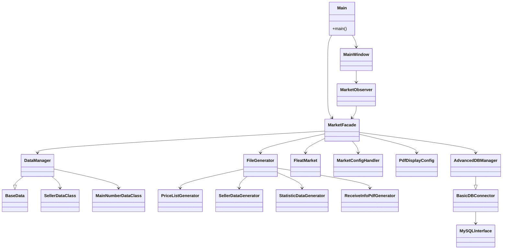

# Flea Market Data Generator

Dieses Projekt dient zur Erzeugung von Datendateien und PDF-Dokumenten für Flohmarktveranstaltungen. Anhand einer JSON-Eingabedatei werden Informationen über Verkäufer und deren Artikellisten verarbeitet und im Anschluss verschiedene Ausgabedateien erzeugt.

## Funktionsüberblick

- Erzeugen von Preislisten, Kundendaten und Statistikdateien (jeweils im `.dat` Format)
- Generierung von Abholbestätigungen als PDF
- Sowohl reine Kommandozeilenausführung als auch ein grafisches Qt-basiertes Interface
- Fortschrittsanzeige über Console- oder GUI-Progressbar

## Installationshinweise

1. Python 3.11 oder neuer installieren
2. Abhängigkeiten installieren:

```bash
pip install -r src/requirements.txt
```

Für Entwicklung/Tests zusätzlich die Dev-Abhängigkeiten installieren:

```bash
pip install -r requirements-test.txt
```

Die Abhängigkeiten umfassen unter anderem `PySide6` für die GUI, `pypdf` und `reportlab` für die PDF-Erzeugung sowie `mysql-connector-python` für optionale Datenbankanbindung. Fehlt `PySide6`, werden Qt-bezogene Tests automatisch übersprungen.

## Verwendung

### Kommandozeile

Das Programm kann direkt über `src/main.py` gestartet werden. Ohne Parameter wird die grafische Oberfläche geöffnet. Durch Angabe einer JSON-Datei lassen sich alle Dateien auch rein über die CLI generieren:

```bash
python src/main.py -f <path/to/data.json> -p <output/dir>
```

Wichtige Optionen:

- `-f`, `--file` – Pfad zur Eingabe-JSON (erforderlich im CLI-Modus)
- `-p`, `--path` – Zielverzeichnis für die generierten Dateien
- `--seller-filename` – Basisname der Kundendatei (Standard `kundendaten`)
- `--price-filename` – Basisname der Preisliste (Standard `preisliste`)
- `--stats-filename` – Basisname der Statistikdatei (Standard `versand`)
- `--pdf-template` – Hintergrund-PDF für die Abholbestätigungen
- `--pdf-output` – Dateiname der erzeugten PDF
- `--verbose` – detailliertere Konsolenausgabe

```bash
python src/main.py -h  # zeigt alle Optionen an
```

### Grafische Oberfläche

Wird das Programm ohne die oben genannten Parameter gestartet, öffnet sich eine Qt-basierte GUI. Über diese können Projekte geladen, Daten eingesehen und die Dateigenerierung gestartet werden.

## Tests

Zum Ausführen der Tests wird `pytest` verwendet:

```bash
pytest -q
```

Einzelne Tests lassen sich gezielt starten, z. B.:

```bash
pytest tests/test_version.py -q
```

Hinweis: Qt-bezogene Tests werden automatisch übersprungen, wenn `PySide6` nicht installiert ist.

## Beitragen

Richtlinien zu Entwicklungsumgebung, Stil, Tests und Pull Requests finden sich in `CONTRIBUTING.md`.

## Projektverwaltung

Die Anwendung kann JSON-Exporte laden und in ein dauerhaftes Projekt überführen.

- **Export laden und umwandeln** – Über *Datei → Export öffnen…* wird eine Export-JSON geladen. Mit *Projekt → Speichern unter…* lässt sich daraus ein neues Projekt anlegen.
- **Projekt speichern** – Beim Speichern erstellt das Programm im Projektordner
  - `<name>.project` – die Projektdatei mit Pfaden und Einstellungen,
  - `pdf_display_config.json` – Layoutdaten für die PDF-Erzeugung,
  - die ursprüngliche Exportdatei.
  Außerdem erzeugt die Datengenerierung im Ausgabeverzeichnis `kundendaten.dat`, `preisliste.dat`, `versand.dat` und `Abholbestaetigungen.pdf`.

### Beispiel

```bash
python src/main.py -f /pfad/zum/export.json -p output
```

In der GUI wählt man **Datei → Export öffnen…**, prüft die Daten und speichert anschließend über **Projekt → Speichern unter…**.


## Projektstruktur

```
src/
├── args.py                    # Parsen der Kommandozeilenargumente
├── main.py                    # Einstiegspunkt (CLI oder GUI)
├── data/                      # Laden und Verwalten der JSON-Daten
│   ├── base.py                # Basisklasse mit Logging-/Output-Funktionen
│   ├── base_data.py           # Laden und Parsen der Hauptdaten
│   ├── data_manager.py        # Erweiterte Logik und Aggregation
│   ├── market_config_handler.py   # Projektkonfigurationen
│   ├── market_facade.py       # Fassade für Marktvorgänge
│   ├── pdf_display_config.py  # Konfiguration für PDF-Layout
│   └── singleton_meta.py      # Implementierung des Singleton-Metaclasses
├── generator/                 # Klassen zum Erzeugen der Ausgabedateien
│   ├── file_generator.py      # Orchestriert alle Generatoren
│   ├── price_list_generator.py
│   ├── seller_data_generator.py
│   ├── statistic_data_generator.py
│   └── receive_info_pdf_generator.py
├── display/                   # Ausgabe- und Fortschrittsabstraktionen
│   ├── output/                # Console/Qt Output-Schnittstellen
│   ├── tracker/               # Fortschritts-Tracker
│   └── progress_bar/          # Anzeige von Fortschritt
├── objects/                   # Domänenobjekte (Artikel, Verkäufer ...)
│   └── data_class_definition.py
└── ui/                        # Qt UI Komponenten
```

Weitere Beispiele und Testskripte liegen im Verzeichnis `examples` bzw. `test_code`.

## Qt-Artefakte erzeugen

Mit dem Skript `util/generate_qt_artefacts.py` lassen sich aus den mit Qt
Designer erstellten `.ui`-Dateien sowie aus der Ressourcenbeschreibung
`resources.qrc` die benötigten Python-Module erzeugen. Ein typischer Aufruf ist

```bash
python util/generate_qt_artefacts.py --all
```

Damit werden alle UI-Dateien aus `src/ui/design` nach `src/ui/generated`
konvertiert und gleichzeitig die Ressourcendatei `resources_rc.py` erstellt.
Weitere Optionen können über `-h` angezeigt werden.

Für den späteren Bau einer ausführbaren Datei mit *auto-py-to-exe* existiert die
Konfigurationsdatei `autopy_build_config.json` (im Repository noch unter dem
Tippfehlernamen `auotpi_build_config.json`). Sie speichert die PyInstaller-
Einstellungen, die von dem Tool eingelesen werden können.

## Wichtige Programmtechniken und Muster

- **Singleton**: Über `SingletonMeta` wird z. B. `MarketFacade` als Singleton umgesetzt, sodass es nur eine Instanz in der Anwendung gibt.
- **Fassade**: `MarketFacade` kapselt das Zusammenspiel aus Datenverwaltung (`DataManager`), Projektdaten und Dateigenerierung.
- **Observer (Signal/Slot)**: Durch die Qt-Signale werden Statusmeldungen und Daten zwischen Komponenten ausgetauscht (z. B. in `DataManager.data_loaded`).
- **Template Method**: Die Klassen in `generator/` erben von `DataGenerator` und implementieren jeweils ihre spezifische `generate` Methode.
- **Abstraktion/Adapter**: In `display/` sind Schnittstellen für Fortschrittsbalken und Ausgaben definiert, wodurch sowohl Konsolen- als auch GUI-Varianten genutzt werden können.
## Architekturdiagramme

Die folgenden Mermaid-Diagramme veranschaulichen den Aufbau der Anwendung. Die
entsprechenden Quelldateien liegen im Ordner `architecture` und sind hier direkt
eingebunden.

### UML Klassendiagramm



### Abhängigkeitsdiagramm


### Architektur-Klassendiagramm


## Tests

Einige Beispiel-Tests befinden sich im Ordner `test_code`. Zusätzlich gibt es PyTest-Dateien im Verzeichnis `tests`. Das Starten von `pytest` benötigt die GUI-Bibliotheken. Wenn `PySide6` nicht installiert ist, werden entsprechende Tests automatisch übersprungen.

Zur Ausführung aller Tests müssen die optionalen Abhängigkeiten aus `requirements-test.txt` installiert werden:

```bash
pip install -r requirements-test.txt
```

```bash
pytest
```

## Lizenz

Dieses Projekt wurde zu Demonstrationszwecken bereitgestellt. Weitere Informationen zur Lizenzierung oder Beiträgen sind aktuell nicht definiert.
