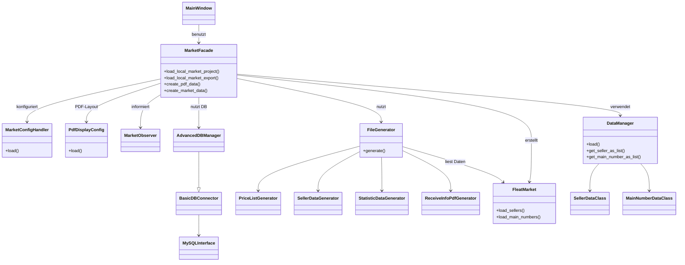

# Architektur Klassendiagramm

Dieses Diagramm skizziert die wichtigsten Klassen der Anwendung und ihr
Zusammenspiel. Über die Fassade `MarketFacade` werden Daten geladen,
Konfigurationsdateien eingelesen und verschiedene Generatoren angestoßen. Die
Daten selbst werden im `DataManager` verwaltet und in der Klasse `FleatMarket`
für die Ausgabe aufbereitet.

