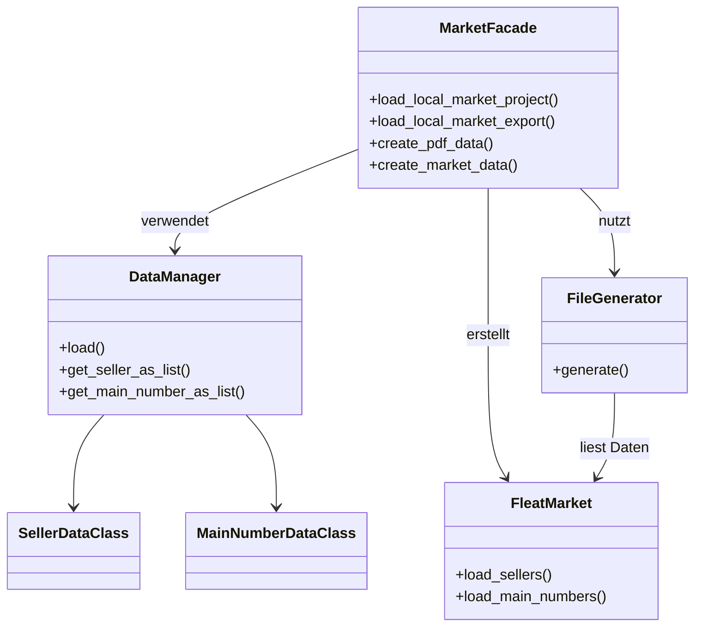

# Architektur Klassendiagramm

```mermaid
classDiagram
    class MarketFacade {
        +load_local_market_project()
        +load_local_market_export()
        +create_pdf_data()
        +create_market_data()
    }
    class DataManager {
        +load()
        +get_seller_as_list()
        +get_main_number_as_list()
    }
    class FileGenerator {
        +generate()
    }
    class FleatMarket {
        +load_sellers()
        +load_main_numbers()
    }
    MarketFacade --> DataManager : verwendet
    MarketFacade --> FleatMarket : erstellt
    MarketFacade --> FileGenerator : nutzt
    FileGenerator --> FleatMarket : liest Daten
    DataManager --> SellerDataClass
    DataManager --> MainNumberDataClass
```
