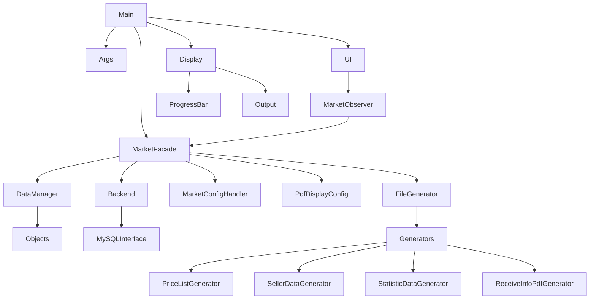

# Abhängigkeitsdiagramm

Dieses Diagramm zeigt die groben Modulabhängigkeiten der Anwendung. Der Start
erfolgt über `main.py`, das wahlweise die Kommandozeile oder die Qt‑Oberfläche
aufbaut. Die Fassade `MarketFacade` kapselt Datenzugriff, Konfiguration und die
Erzeugung der Ausgabedateien.

