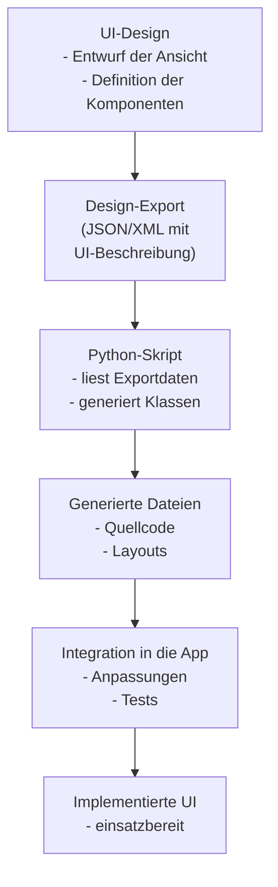

# UI-Erstellungsablauf

Dieses Diagramm veranschaulicht die einzelnen Schritte vom Design der Oberfläche bis zur fertigen Implementierung. Jeder Knoten beschreibt kurz, was im jeweiligen Schritt passiert.

