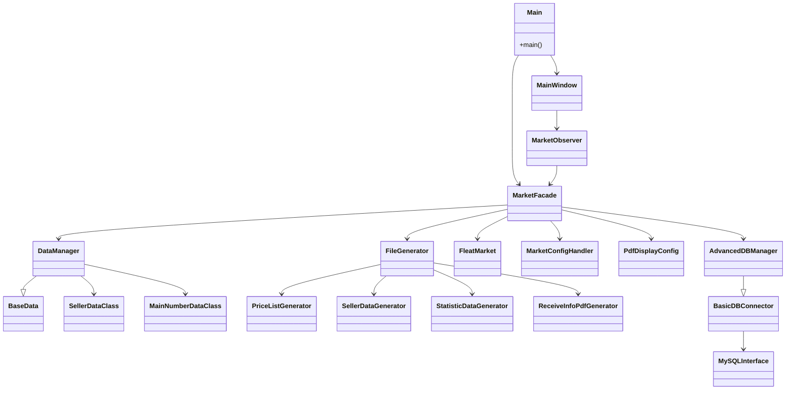

# UML Klassendiagramm

Das UML‑Diagramm bildet die zentralen Klassen des Projekts ab. Es zeigt, wie die
GUI über `MainWindow` mit der `MarketFacade` kommuniziert und welche Generatoren
für die Dateiausgabe verantwortlich sind.

