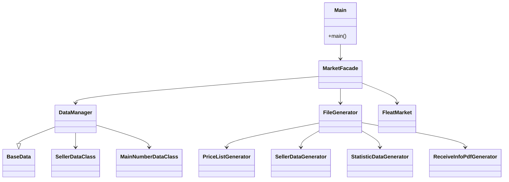

# UML Klassendiagramm

```mermaid
classDiagram
    class Main {
        +main()
    }
    class MarketFacade
    class DataManager
    class BaseData
    class FileGenerator
    class PriceListGenerator
    class SellerDataGenerator
    class StatisticDataGenerator
    class ReceiveInfoPdfGenerator
    class FleatMarket
    class SellerDataClass
    class MainNumberDataClass

    Main --> MarketFacade
    MarketFacade --> DataManager
    MarketFacade --> FileGenerator
    MarketFacade --> FleatMarket
    DataManager --|> BaseData
    DataManager --> SellerDataClass
    DataManager --> MainNumberDataClass
    FileGenerator --> PriceListGenerator
    FileGenerator --> SellerDataGenerator
    FileGenerator --> StatisticDataGenerator
    FileGenerator --> ReceiveInfoPdfGenerator
```
